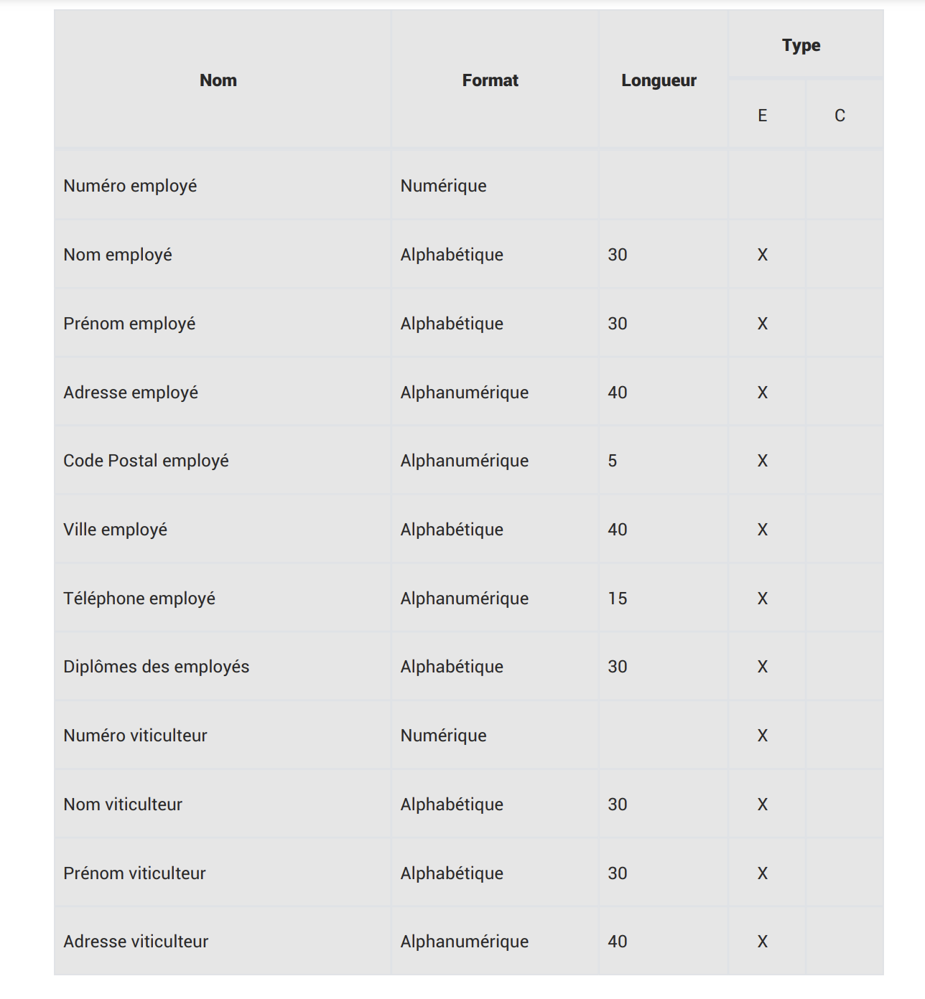
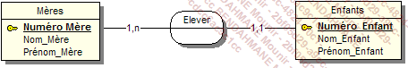
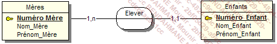
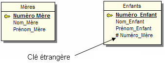
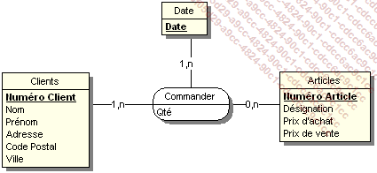
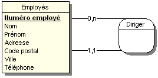

# Cours modélisation de données

## 1. Commandes Git

Cette commande va initialiser un dépôt Git. Git va traquer les modifs effectuées au sein de ce dossier.

```sh
git init
```

Pour consulter l'etat du dépôt Git, il suffit de lancer cette commande:

```sh
git status
```

Cette commande va afficher les fichiers qui ont été modifiés depuis le dernier commit.

Pour ajouter un fichier au prochain commit, il faut utiliser la commande:

```sh
git add <nom du fichier>
```

Pour ajouter tous les fichiers modifiés au prochain commit, il faut utiliser la commande:

```sh
git add .
```

Pour enregistrer les modifications dans le dépôt Git, il faut utiliser la commande:

```sh
git commit -m "Message du commit"
```

Pour récupérer les modifications effectuées sur le dépôt Git, il faut utiliser la commande:

```sh
git pull
```

## 2. Merise

Merise est une méthode de modélisation de données. Elle permet de représenter les données d'un système d'information.
Merise est un acronyme de : Méthode d'Etude et de Réalisation Informatique pour les Systemes d'Entreprise.

Présentation générale de Merise:
Cette méthode est composée de 3 points clés :

- Une approche dite systémique : on transforme les process de l'entreprise en système d'information.
- une séparation des données et des traitements : on sépare les données et les traitements pour faciliter la maintenance.
- une approche nivelée : on découpe le système d'information en plusieurs niveaux.

### 2.1 L'appoche systémique


Le système de pilotage :

- Il est composé de l'ensemble des acteurs qui vont **piloter** le système d'information.

Le système d'information :

- Il est composé de l'ensemble des acteurs qui vont **utiliser** le système d'information.

Le système opérant :

- Il est composé de l'ensemble des acteurs qui vont **produire** les données du système d'information.

### 2.2 La séparation des données et des traitements

La séparation des données et des traitements permet de séparer les données du système d'information et les traitements éffectués sur ces données.
Cette démarche se fait en 3 étapes :

- L'analyse des flux : on analyse les flux d'informations entre les acteurs du système d'information et les acteurs du système opérant.
- L'étude des documents internes (factures, bon de livraison, etc...).
- L'étude des documents externes (fournisseurs, clients, etc...).

Les différents types d'informations :

- les infos de bases ou élmentaires : ce sont les informations qui sont à l'origine du système d'information.
- les informations calculées : ce sont les informations qui sont calculées à partir des informations de bases.
- les traitements ou les fonctions : ce sont les traitements qui sont effectués sur les informations de bases pour obtenir les informations calculées.

En résumé : vous devrez identifiées les données et les traitements effectués sur ces données.

### 2.3 L'approche nivelée

Pour effectuer la conception d'un SI, on va utiliser une approche nivelée. Cette approche se compose de 4 niveaux :

- Le niveau conceptuel : on va représenter les données du système d'information.
- Le niveau organisationnel : on va représenter les traitements du système d'information.
- Le niveau logique : on va représenter les données et les traitements du système d'information.
- Le niveau physique : on va représenter les données et les traitements du système d'information.

#### 2.3.1 Le niveau conceptuel

Le niveau conceptuel permet de modéliser les données de l'entreprise. On va utiliser le modèle conceptuel de données (MCD) pour représenter les données de l'entreprise et le MCT pour représenter les traitements de l'entreprise.

#### 2.3.2 Le niveau organisationnel

Le niveau organisationnel va permettre d'intégrer à l'analyse précédente toutes les notions de temporalité, de chronologie des opérations, de contraintes géographiques. On va utiliser le modèle organisationnel des traitements (MOT) et le modèle organisationnel des données (MOD) pour modéliser les traitements de l'entreprise.

En résumé, on se pose les questions suivantes à partir des données recueillies au niveau conceptuel :

- **Quand** les traitements sont-ils effectués ?
- **Où** les traitements sont-ils effectués ?
- **Qui** effectue les traitements ?

#### 2.3.3 Le niveau logique

Le niveau logique va permettre de modéliser les données de l'entreprise en utilisant le modèle logique de données (MLD) et les traitements de l'entreprise en utilisant le modèle logique des traitements (MLT).

Le MLD est indépendant des langages de programmation et des SGBD.

On répond à la question : **Avec quoi** les traitements sont-ils effectués ?

#### 2.3.4 Le niveau physique

Il s'agit de l'organisation `réelle` des données. On va utiliser le modèle physique de données (MPD) et le modèle physique des traitements (MPT).

Ici, on apporte les solutions techniques de stockage des données et des traitements.

On répond à la question : **Comment** les traitements sont-ils effectués ?

#### Les 4 niveaux de Merise


## 3. Des données aux dépendances fonctionnelles

Pour être intégrées dans un système d'information, les données doivent être triées et organisées. On va souvent tenter de les classer par type de données :

- chaînes de caractères, format texte
- type alpha-numérique, format texte
- type numérique, format numérique (integer, float, etc...)
- type date, format date (date, datetime, timestamp, etc...)
- type booléen, format booléen (true, false)

Création d'un dictionnaire de données


| Nom de la donnée | Format  | Longueur | Type (élémentaire/calculé) |      Règle de calcul      | Règle de gestion | Document |
| :--------------: | :-----: | :------: | :------------------------: | :-----------------------: | :--------------: | :------: |
|      Numéro      | Integer |    11    |        élémentaire         |                           |                  |  Fiche   |
|       Nom        | Varchar |   100    |        élémentaire         |                           |                  |    //    |
|      Prénom      | Varchar |   100    |        élémentaire         |                           |                  |    //    |
|     Adresse      | Varchar |   200    |        élémentaire         |                           |                  |    //    |
|   Code postal    | Varchar |    5     |        élémentaire         |                           |                  |    //    |
|      Ville       | Varchar |   100    |        élémentaire         |                           |                  |    //    |
|    Téléphone     | Varchar |    20    |        élémentaire         |                           |                  |    //    |
|      Email       | Varchar |   100    |        élémentaire         |                           |                  |    //    |
| Date d'adhésion  |  Date   |          |        élémentaire         |                           |                  |    //    |
|  Numéro facture  | Integer |          |        élémentaire         |                           |                  | Facture  |
|     Article      | Varchar |   100    |        élémentaire         |                           |                  |    //    |
|     Quantité     | Integer |          |        élémentaire         |                           |                  |    //    |
|  Prix unitaire   |  Float  |          |        élémentaire         |                           |                  |    //    |
|     Montant      |  Float  |          |          calculé           | Quantité \* Prix unitaire |                  |    //    |
|   Date facture   |  Date   |          |        élémentaire         |                           |                  |    //    |
| Numero de compte | Integer |          |        élémentaire         |                           |                  |    //    |
|   Code guichet   | Integer |          |        élémentaire         |                           |                  |    //    |
|   Code banque    | Integer |          |        élémentaire         |                           |                  |    //    |
|     Clé RIB      | Integer |          |        élémentaire         |                           |                  |    //    |

### 3.1 Les dépendances fonctionnelles

Une dépendance fonctionnele est une relation entre deux attributs d'une table. Elle permet de définir une relation de dépendance entre deux attributs d'une table.





Le but de l'exercice est d'élaborer un MCD à partir d'un dictionnaire de données.

Ici on va introduire les notions d'entité, de relations et de propriétés.

**Les propriétés sont les informations de bases d'un SI.**

Le rôle d'une dépendance fonctionnelle est de permettre de définir une relation de dépendance entre deux attributs d'une table : une donnéee A dépend fonctionnellement d'une donnée B si et seulement si à une valeur de B correspond une seule valeur de A.

Pour formaliser une dépendance fonctionnelle, on utilise la notation suivante : `Numero adherent (Nom, prenom, cp, ville, tel, date adhesion, email)`
La partir gauche est la source de la dépendance fonctionnelle et la partie droite est le but de la dépendance fonctionnelle.

#### 3.1.1 Les dépendances fonctionnelles composées

Si une dépendance fonctionnelle qui fait intervenir plus de 2 attributs, on parle de dépendance fonctionnelle composée.

Exemple : Pour connnaître le temps d'un coureur sur une étape donnée, il nous faut son numéro ou son nom ainsi que le nom ou le numero de l'étape.

Formalisation :
`(numero coureur, numero etape) (temps)`

#### 3.1.2 Les dépendances fonctionnelles élémentaires

Une dépndance fonctionnelle A -> B est élémentaire s'il n'existe pas une donnée C, sous-ensemble de A, décrivant une dépendance fonctionnelle type C -> B.

Exemples :

- RefProduit -> LibelleProduit
- NumCommande RefProduit -> QuantiteCommandee
- <strike>NumCommande RefProduit -> DesignationProduit</strike>

#### 3.1.3 Les dépendances fonctionnelles élémentaires directs

Exemple :
RefPromo -> NumApprenant
NumApprenant -> NomApprenant
RefPromo -> NomApprenant

#### 3.1.4 Les entités

Les entités permettent de regrouper les propriétés qui ont des liens entre elles.

Quelques définitions :

- entité forte : une entité forte est une entité qui ne dépend pas d'une autre entité pour exister.
- entité faible : une entité faible est une entité qui dépend d'une autre entité pour exister.


#### 3.1.5 Les relations

Les relations permettent de définir les liens entre les entités.


##### 3.1.5.1 Les relations porteuses

Une relation porteuse est une relation qui possède des propriétés.


##### 3.1.5.2 Les relations réflexives

Une relation réflexive est une relation qui relie une entité à elle-même.


#### 3.1.6 Les cardinalités


Elles permettent de définir le nombre d'occurences d'une entité par rapport à une autre entité.

#### Exercice TP MCD




**Quelques règles de conception :**

- toute entité doit avoir un identifiant.
- toutes les propriétés dépendent fonctionnellement de l'identifiant.
  -le nom de la propriété ne doit apparaître qu'une seule fois dans le MCD : si vous avez une entité Eleve et une entité Professeur, vous ne pouvez pas avoir une propriété nom dans les deux entités. Il faut donc renommer la propriété nom en nom_eleve et nom_professeur.
- les propriétés issues d'un calcul ne doivent pas apparaître dans le MCD.

### 3.2 Les contraintes d'intégrité fonctionnelle (CIF)

Définiton : Une CIF est déinie par le fait qu'une des entités de l'association est complètement déterminée par la connaissance d'une ou plusieurs autres entités de l'association.


Une salle peut contenir 0 ou plusieurs ordinateurs et un ordinateur peut être dans une et une seule salle.
Dans ce type de relation, une CIF existe si on a une cardinalité 1,1.

### 3.3 Modèle logique des données (MLD)

Le MLD est la suite du processus de Merise, on se rapproche un peu plus de la base de données.

Partons du MCD suivant :



Nous avons le modèle suivant :



L'`entité` qui possède la cardinalité 1,1 ou 0,1 absorbe l'identifiant de l'entité la plus forte (0,n ou 1,n). Cet identifiant devient alors une clé étrangère.

#### 3.3.1 Cas (0,n), (0,n) ou (1,n), (1,n)

Partons du MCD suivant :


Dans le cas où la `cardinalité max` est n des 2 côtés, on crée une entité intermédiaire qui va contenir les clés étrangères des 2 entités.


Continuons avec le MCD suivant :



On obtient le MLD suivant en suivant la même logique :


#### 3.3.2 Cas d'une relation réflexive

Partons du MCD suivant :




##### Exercice pratique


Voici le MLD :


### 3.4 Modèle physique des données (MPD)

Voici le schema relationnel correspondant au MLD precedent :

- Diplômes (Diplomes)
- Possède (#NumEmployé, #Diplôme, Date d’obtention)
- Employés (NumEmployé, Nom, Prénom, Adresse, Code Postal, Ville, Téléphone)
- Tables (NumTable, Capacité)
- Date (Date)
- Service (TypeService, Désignation)
- Boissons Diverses (NumBoissons, Désignation, Prix de vente)
- Contenir (#NumCommande, #NumBoissons, Quantité)
- Commande (NumCommande, #Numemployé, #Date, #TypeService, #NumTable)
- Comprend (#NumMenu, #NumCommande, Quantité)
- Menus (NumMenu, Libellé, Prix de vente)
- Constitué (#NumMenu, #NumPlat)
- Constituer (#NumCommande, #NumPlat, Quantité)
- Sélectionner (#NumCommande, #NumVin, Quantité)
- Carte des vins (NumVin, Nom du vin, Millesime, Prix de vente)
- Carte des plats (NumPlat, LibelléPlat, Prix de vente, #NumType)
- Type des plats (NumType, Désignation)
- Bouteilles (NumBouteille, Date Achat, Prix d’achat, # NumVin, #NumViticulteur)
- Viticulteur (NumViticulteur, Nom viticulteur, Prénom viticulteur, Adresse viticulteur, Code postal, Ville, Téléphone)

A partir d'ici il est facile de generer le script SQL correspondant.

```SQL
CREATE TABLE CARTE_DES_VINS
   (
   NUMVIN INTEGER(2) NOT NULL ,
   NOM_DU_VIN CHAR(40)   ,
   MILLESIME INTEGER(2)  ,
   PRIX_DE_VENTE REAL(5,2)
,
    PRIMARY KEY (NUMVIN) CONSTRAINT PK_CARTE_DES_VINS
   );

CREATE TABLE BOUTEILLES
   (
   NUMVITICULTEUR INTEGER(2) NOT NULL ,
   NUMVIN INTEGER(2) NOT NULL ,
   NUMBOUTEILLE INTEGER(2) NOT NULL ,
   DATE_ACHAT DATE(8) ,
   PRIX_D_ACHAT REAL(5,2)
,
    PRIMARY KEY (NUMVITICULTEUR, NUMVIN, NUMBOUTEILLE) CONSTRAINT
PK_BOUTEILLES
   );


CREATE TABLE VITICULTEUR
   (
   NUMVITICULTEUR INTEGER(2) NOT NULL ,
   NOM_VITICULTEUR CHAR(20) ,
   PRÉNOM_VITICULTEUR CHAR(20) ,
   ADRESSE_VITICULTEUR CHAR(40) ,
   CODE_POSTAL CHAR(5) ,
   VILLE CHAR(40) ,
   TÉLÉPHONE CHAR(15)
,
    PRIMARY KEY (NUMVITICULTEUR) CONSTRAINT PK_VITICULTEUR
   );
```

## 4 Exercices pratiques

##### N°1

##### N°2

##### N°3

##### N°4

MCD et MLD sur le meme fichier 'Exo_4.asi'. Le MCD est en haut et le MLD en bas.

```SQL
CREATE TABLE PROPRIETAIRE
   (
   ID_PROPRIETAIRES INT(1000) NOT NULL PRIMARY KEY,
   NOM CHAR(100) ,
   PRENOM CHAR(100) ,
   ADRESSE CHAR(200) ,
   TELEPHONE CHAR(20) ,
   MAIL CHAR(200)
   );

CREATE TABLE MAISONS
   (
    ID_MAISON CHAR(50) NOT NULL PRIMARY KEY,
    CP VARCHAR(50),
    VILLE CHAR(100),
    SUPERFICIE FLOAT(50),
    );

CREATE TABLE LOCATAIRES
    (
      ID_LOCATAIRE INT(1000) NOT NULL PRIMARY KEY,
      NOM CHAR(100) ,
      PRENOM CHAR(100) ,
      ADRESSE CHAR(200) ,
      TELEPHONE CHAR(20) ,
      MAIL CHAR(200)
    )
```

##### N°5

MCD et MLD sur le meme fichier 'Exo_5.asi'. Le MCD est en haut et le MLD en bas.

```SQL
CREATE TABLE PROPRIETAIRE
   (
   NUMPROPRIETAIRE INTEGER(2) NOT NULL PRIMARY KEY,
   NOM CHAR(100) ,
   PRENOM CHAR(100) ,
   ADRESSE CHAR(200) ,
   TELEPHONE CHAR(20) ,
   FAX CHAR(100) ,
   EMAIL CHAR(200)
   );

CREATE TABLE VEHICULE
   (
    IMMATRICULATION CHAR(50) NOT NULL PRIMARY KEY,
    MARQUE CHAR(50),
    DATEMISEENCIRCULATION DATE(8) ,
    PUISSANCEFISCALE INTEGER(2) ,
    NOMBREDEPORTES INTEGER(2) ,
    NOMBREDEPASSAGERS INTEGER(2) ,
    POIDSVIDE INTEGER(2) ,
    POIDSAUTORISE INTEGER(2) ,
    LONGUEUR INTEGER(2) ,
    LARGEUR INTEGER(2)
    );

CREATE TABLE CONTRAT
    (
      NUMCONTRAT INTEGER(2) NOT NULL PRIMARY KEY,
      DATECONTRAT DATE(8) ,
      CATEGORIE CHAR(50)
    )
```

##### N°6

MCD et MLD sur le meme fichier 'Exo_5.asi'. Le MCD est en haut et le MLD en bas.

```SQL
CREATE TABLE PRODUITS
   (
   REFERENCE INT(1000000) NOT NULL PRIMARY KEY,
   DESIGNATION CHAR(100) ,
   DESCRIPTIF CHAR(255) ,
   PRIX_VENTE_CATALOGUE FLOAT(50) ,
   HEURES_MAIN_OEUVRE INT(50) ,
   PRIX_ACHAT_UNITAIRE FLOAT(50)
   );

CREATE TABLE FOURNISSEURS
   (
    ID_FOURNISSEUR INT(1000000) NOT NULL PRIMARY KEY,
    RAISON_SOCIALE CHAR(100),
    ADRESSE CHAR(200),
    CP CHAR(20),
    VILLE CHAR(50),
    TELEPHONE CHAR(20),
    EMAIL CHAR(200)
    );

CREATE TABLE COMMANDES
    (
      NUM_COMMANDE INTEGER(1000000) NOT NULL PRIMARY KEY,
      DATE_COMMANDE DATE(8) ,
      DATE_LIVRAISON DATE(8) ,
      QUANTITE INTEGER(2) ,
      PRIX_UNITAIRE FLOAT(50)
    ) ;
```

##### N°7
